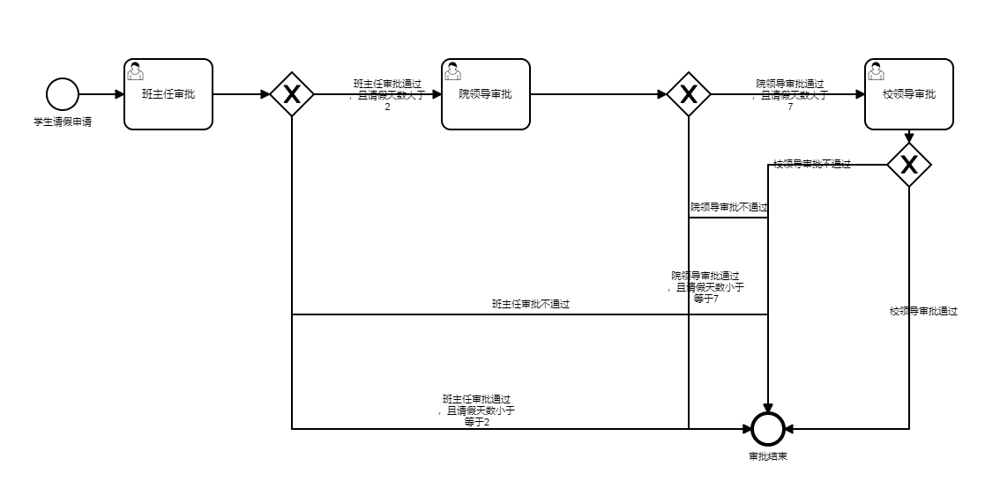
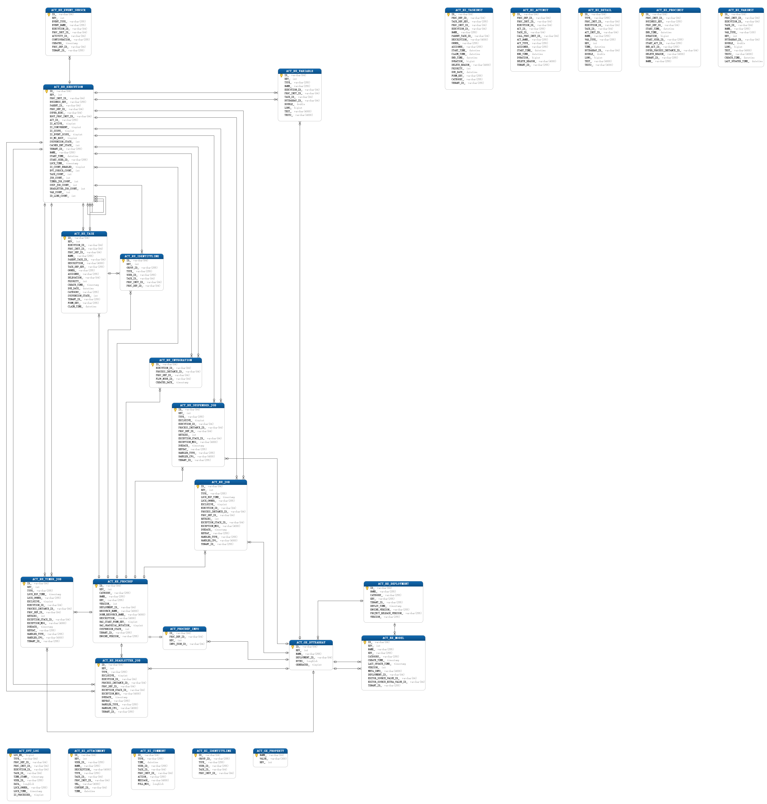
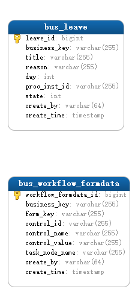

## 什么是BPMN（Business Process Model and Notation）

### 概述

业务流程模型和标记法（BPMN, Business Process Model and Notation）是对象管理组织（OMG, Object Management Group）维护的关于业务流程建模的行业性标准。它创建在与UML的活动图非常相似的流程图法（flowcharting）基础上，为“业务流程图”（BPD, Business Process Diagram）中的特定业务流程提供一套图形化标记法。BPMN的目标是，通过提供一套既符合业务人员直观又能表现复杂流程语义的标记法，同时为技术人员和业务人员从事业务流程管理提供支持。BPMN规范还提供从标记法的图到执行语言基础构造的映射，尤其是业务流程执行语言（BPEL）。

BPMN的首要目的是提供全体业务相关者易于理解的标准标记法。业务相关者包括创造与梳理流程的业务分析师、负责实施流程的技术开发者、以及管理和监督流程的经理人。BPMN旨在充当公共语言，跨越业务流程设计和实施之间常见的鸿沟。

当前有多种竞争的业务流程建模语言标准供建模过程和工具选用。广泛采用BPMN将有助于统一基本的业务流程概念的表达（例如：公共或私有的流程、编排），就像一些高级的业务概念一样（例如：例外处理、事务补偿）。

### 历史

BPMN最初由业务流程管理倡议组织（BPMI, Business Process Management Initiative）开发，该组织于2005年与对象管理组织（OMG, Object Management Group）合并，从那时起，由OMG维护。BPMN最初的名称为"Business Process Modeling Notation"，即“业务流程建模标记法”，2011年1月OMG发布2.0版本，同时改为现在的名称。

### 基本组成

- 流对象（Flow Object）
    - 事件（Events）
        - 开始事件（Start event）
        - 结束事件（End event）
        - 中间事件（Intermediate event）
    - 活动（Activities）
        - 任务（Task）
        - 子流程（Sub-process）
        - 事务（Transaction）
    - 网关（Gateways）
        - 排他网关（Exclusive Gateway）
        - Exclusive Gateway Example
        - Parallel Gateway
        - Inclusive Gateway
        - Exclusive Event-based Gateway
        - Complex Decision Gateway
        - Parallel Event-Based Gateway
- 连接对象（Connecting Objects）
    - 顺序流（Sequence Flow）
    - 消息流（Message Flow）
    - 关联（Association）
- 泳道（Swimlanes）
    - 池（Pool）
    - 道（Lane）
- 器物（Artifacts/Artefacts）
    - 数据对象（Data Object）
    - 组（Group）
    - 注释（Annotation）

### 怎么通过BPMN描述一个工作流程？

假设有这么一个场景：

学生申请请假，请假天数为变量day；

当day小于等于2时，只需要班主任审批通过；

当day大于2小于等于7时，同时需要班主任和院领导依次审批通过；

当day大于7时，同时需要班主任、院领导和校领导依次审批通过；

---

通过BPMN绘制的图如下：

<center>
    
    <br>
    <div style="color:orange; border-bottom: 1px solid #d9d9d9;
    display: inline-block;
    color: #999;
    padding: 2px;">学生请假流程</div>
</center>

---

## 什么是Activiti

Activiti是用Java编写的开源 工作流引擎，可以执行BPMN 2.0中描述的业务流程。 Activiti是Alfresco Alfresco过程服务（APS）的基础，而Alfresco是Activiti项目的主要赞助商。

### 历史

2010年3月，jBPM的两个主要开发人员Tom Baeyens和Joram Barrez离开了Red Hat，并以Alfresco的雇员的身份创立了Activiti 。Activiti基于他们在jBPM上的工作流程经验，但它是一个新的代码库，而不是基于任何以前的jBPM代码。

Activiti的第一个版本是5.0，表明产品是他们通过jBPM 1到4获得的经验的延续。

2016年10月，Barrez，Rademakers（Activiti in Action 的作者）和其他贡献者离开了Alfresco。即将离任的开发人员分叉了Activiti代码以启动一个名为Flowable的新项目。

2017年2月，发布了新的Activiti商业版，并将其更名为Alfresco Process Services。

2017年5月，Activiti发布了版本6.0.0 ，其中对ad-hoc子流程提供了新的支持，并提供了新的应用程序用户界面。

>[Another rift in the open source BPM market](https://web.archive.org/web/20161230085710/https://www.enterpriseirregulars.com/110881/another-rift-open-source-bpm-market-flowablebpm-forks-alfresco-activiti/)

>[Activiti founders fork the project to create Flowable, an open source BPM engine](https://web.archive.org/web/20161230090047/http://ecmarchitect.com/archives/2016/10/15/4192)

---

## Activiti使用

### Activiti几个核心的接口

|类名称|用途|
|:---|:---|
|[DynamicBpmnService](https://www.activiti.org/javadocs/org/activiti/engine/DynamicBpmnService.html)|提供对流程定义和部署存储库的访问的服务。|
|[EngineServices](https://www.activiti.org/javadocs/org/activiti/engine/EngineServices.html)|由所有公开Activiti服务的类实现的接口。|
|[FormService](https://www.activiti.org/javadocs/org/activiti/engine/FormService.html)||
|[HistoryService](https://www.activiti.org/javadocs/org/activiti/engine/HistoryService.html)|服务公开有关正在进行和过去的流程实例的信息。|
|[IdentityService](https://www.activiti.org/javadocs/org/activiti/engine/RuntimeService.html)|管理用户和用户组的操作|
|[ManagementService](https://www.activiti.org/javadocs/org/activiti/engine/ManagementService.html)|在流程引擎上进行管理和维护操作的服务|
|[ProcessEngine](https://www.activiti.org/javadocs/org/activiti/engine/RuntimeService.html)|提供对公开BPM和工作流操作的所有服务的访问|
|[ProcessEngineInfo](https://www.activiti.org/javadocs/org/activiti/engine/ProcessEngineInfo.html)|表示有关流程引擎初始化的信息|
|[ProcessEngineLifecycleListener](https://www.activiti.org/javadocs/org/activiti/engine/ProcessEngineLifecycleListener.html)|描述监听器的接口，该监听器在发生特定事件时会得到通知，与其关联的流程引擎生命周期相关|
|[RepositoryService](https://www.activiti.org/javadocs/org/activiti/engine/RepositoryService.html)|提供对流程定义和部署存储库的访问的服务。|
|[RuntimeService](https://www.activiti.org/javadocs/org/activiti/engine/RuntimeService.html)|提供对流程控制的操作|
|[TaskService](https://www.activiti.org/javadocs/org/activiti/engine/TaskService.html)|提供访问Task相关的操作|

<center>
    <br>
    <div style="color:orange; border-bottom: 1px solid #d9d9d9;
    display: inline-block;
    color: #999;
    padding: 2px;">Activiti主要API</div>
</center>

### 数据库表设计

Activiti引擎表结构设计如下：

<center>
    
    <br>
    <div style="color:orange; border-bottom: 1px solid #d9d9d9;
    display: inline-block;
    color: #999;
    padding: 2px;">Activiti表结构</div>
</center>

---

业务数据表结构如下：

<center>
    
    <br>
    <div style="color:orange; border-bottom: 1px solid #d9d9d9;
    display: inline-block;
    color: #999;
    padding: 2px;">业务数据表结构</div>
</center>

---

不同前缀的表说明：

- ACT_RE_*: 'RE'表示repository。 这个前缀的表包含了流程定义和流程静态资源 （图片，规则，等等）。
- ACT_RU_*: 'RU'表示runtime。 这些运行时的表，包含流程实例，任务，变量，异步任务，等运行中的数据。 Activiti只在流程实例执行过程中保存这些数据， 在流程结束时就会删除这些记录。 这样运行时表可以一直很小速度很快。
- ~~ACT_ID_*: 'ID'表示identity。 这些表包含身份信息，比如用户，组等等。~~
- ACT_HI_*: 'HI'表示history。 这些表包含历史数据，比如历史流程实例， 变量，任务等等。
- ACT_GE_*: 通用数据， 用于不同场景下，如存放资源文件。

|表名|用途|备注|
|:---|:---|:---|
|ACT_EVT_LOG|事件处理日志|-|
|ACT_GE_BYTEARRAY|二进制数据表|存储流程定义相关的部署信息。即流程定义文档的存放地。每部署一次就会增加两条记录，一条是关于BPMN规则文件的，一条是图片的（如果部署时只指定了BPMN一个文件，Activiti会在部署时解析BPMN文件内容自动生成流程图）。两个文件不是很大，都是以二进制形式存储在数据库中。|
|ACT_GE_PROPERTY|主键生成表|主张表将生成下次流程部署的主键ID。|
|ACT_HI_ACTINST|历史节点表|只记录usertask内容,某一次流程的执行一共经历了多少个活动|
|ACT_HI_ATTACHMENT|历史附件表|-|
|ACT_HI_COMMENT|历史意见表|-|
|ACT_HI_DETAIL|历史详情表，提供历史变量的查询|流程中产生的变量详细，包括控制流程流转的变量等|
|ACT_HI_IDENTITYLINK|历史流程人员表|-|
|ACT_HI_PROCINST|历史流程实例表|-|
|ACT_HI_TASKINST|历史任务实例表|一次流程的执行一共经历了多少个任务|
|ACT_HI_VARINST|历史变量表|-|
|ACT_PROCDEF_INFO||-|
|ACT_RE_DEPLOYMENT|部署信息表|存放流程定义的显示名和部署时间，每部署一次增加一条记录|
|ACT_RE_MODEL|流程设计模型部署表|流程设计器设计流程后，保存数据到该表|
|ACT_RE_PROCDEF|流程定义数据表|存放流程定义的属性信息，部署每个新的流程定义都会在这张表中增加一条记录。注意：当流程定义的key相同的情况下，使用的是版本升级|
|ACT_RU_DEADLETTER_JOB|-|-|
|ACT_RU_EVENT_SUBSCR|throwEvent，catchEvent时间监听信息表|-|
|ACT_RU_EXECUTION|运行时流程执行实例表|历史流程变量|
|ACT_RU_IDENTITYLINK|运行时流程人员表|主要存储任务节点与参与者的相关信息|
|ACT_RU_INTEGRATION|-|-|
|ACT_RU_JOB|运行时定时任务数据表|-|
|ACT_RU_SUSPENDED_JOB|-|-|
|ACT_RU_TASK|运行时任务节点表|-|
|ACT_RU_TIMER_JOB|-|-|
|ACT_RU_VARIABLE|运行时流程变量数据表|通过JavaBean设置的流程变量，在act_ru_variable中存储的类型为serializable，变量真正存储的地方在act_ge_bytearray中。|

---

### 导入BPMN文件

```java
@Operation(summary = "部署工作流设计", description = "部署工作流设计")
@PostMapping(value = "/deploy", consumes = MediaType.MULTIPART_FORM_DATA_VALUE)
public void deployProcess(
        @Schema(description = "流程设计文件") MultipartFile file,
        @Schema(description = "部署名称")
        @RequestParam() String name,
        @Schema(description = "部署key")
        @RequestParam() String key,
        @Schema(description = "分类")
        @RequestParam() String category,
        @Schema(description = "租户ID")
        @RequestParam(required = false) String tenantId) {
    String filename = file.getOriginalFilename();
    try (InputStream fileInputStream = file.getInputStream()) {
        repositoryService.createDeployment()//初始化流程
                .addInputStream(filename, fileInputStream)
                .name(name)
                .tenantId(tenantId)
                .key(key)
                .category(category)
                .deploy();
    } catch (IOException e) {
        e.printStackTrace();
    }
}
```

### 启动流程实例

```java
public int insertLeave(HttpServletRequest request, Leave leave) {
    Map<String, Object> params = CommonUtils.getParametersStartingWith(request,
            GlobalConstant.ACTIVITI_PARAMS_PREFIX);
    String businessKey = "leave:" + UUID.randomUUID().toString();

    StartProcessPayloadBuilder builder = ProcessPayloadBuilder
            .start()
            .withProcessDefinitionKey("leave_stu")
            .withName("leave_stu")
            .withBusinessKey(businessKey);

    if (!CollectionUtils.isEmpty(params)) {
        builder.withVariables(params);
    }

    StartProcessPayload processPayload = builder
            .build();

    ProcessInstance processInstance = processRuntime.start(processPayload);
    String procInstId = processInstance.getId();


    leave.setProcInstId(procInstId);
    leave.setBusinessKey(businessKey);
    return leaveMapper.insertLeave(leave);
}
```

### Task审批

```java
public void check(HttpServletRequest request, String taskId) {
    Task task = taskService.createTaskQuery().taskId(taskId).singleResult();
    ProcessInstance processInstance = processRuntime.processInstance(task.getProcessInstanceId());
    String businessKey = processInstance.getBusinessKey();
    String formKey = task.getFormKey();
    String taskName = task.getName();
    Date current = new Date();

    String username = (String) session.getAttribute(GlobalConstant.CUR_USERNAME);

    Map<String, Object> params = CommonUtils.getParametersStartingWith(request,
            GlobalConstant.ACTIVITI_PARAMS_PREFIX);

    if (!CollectionUtils.isEmpty(params)) {
        taskService.complete(task.getId(), params);
    } else {
        taskService.complete(task.getId());
    }

    UserTask userTask = (UserTask) repositoryService.getBpmnModel(task.getProcessDefinitionId())
            .getFlowElement(formKey);

    List<FormProperty> formProperties = userTask.getFormProperties();

    for (FormProperty formProperty : formProperties) {
        String id = formProperty.getId();
        String name = formProperty.getName();
        String value = (String) params.get(id);

        WorkflowFormdata workflowFormdata = new WorkflowFormdata();
        workflowFormdata.setBusinessKey(businessKey);
        workflowFormdata.setFormKey(formKey);
        workflowFormdata.setControlId(id);
        workflowFormdata.setControlName(name);
        workflowFormdata.setControlValue(value);
        workflowFormdata.setTaskNodeName(taskName);
        workflowFormdata.setCreateBy(username);
        workflowFormdata.setCreateTime(current);
        workflowFormdataMapper.insertWorkflowFormdata(workflowFormdata);
    }
}
```

### Task逻辑自动处理

```java
```

### 撤回功能

```java
```

### 流程实例监听

```java
package com.sd.activiti.listen;

import com.sd.activiti.domain.Leave;
import com.sd.activiti.service.LeaveService;
import com.sd.activiti.utils.SpringContextUtil;
import org.activiti.engine.delegate.DelegateExecution;
import org.activiti.engine.delegate.ExecutionListener;
import org.activiti.engine.delegate.Expression;
import org.slf4j.Logger;
import org.slf4j.LoggerFactory;


public class LeaveEndStateListener implements ExecutionListener {

    private static final Logger log = LoggerFactory.getLogger(LeaveEndStateListener.class);

    private Expression state;

    @Override
    public void notify(DelegateExecution delegateExecution) {
        LeaveService leaveService = SpringContextUtil.getBean("leaveServiceImpl", LeaveService.class);
        String businessKey = delegateExecution.getProcessInstanceBusinessKey();
        String value = state.getValue(delegateExecution).toString();
        log.info("bus_key:{}, value:{}", businessKey, value);
        Leave leave = leaveService.selectLeaveByBusinessKey(businessKey);
        leave.setState(Integer.valueOf(value));
        leaveService.updateLeave(leave);
    }
}

```

## 总结

---

## 遇到的问题

### Spring boot 初始化表格报错

  如果同一个数据库地址下面有多个库，当其中某个库已经生成过表时。别的库生成数据库的时候会报错。在数据库URL后面加上参数`nullCatalogMeansCurrent=true`  
例如：`jdbc:mysql://127.0.0.1:3306/activiti?nullCatalogMeansCurrent=true`  
> [深入分析mysql 6.0.6 和 activiti 6.0.0自动创建表失败的问题](https://blog.csdn.net/jiaoshaoping/article/details/80748065)

## 扩展阅读

### 什么是Flowable

官方解释：

> Flowable is a light-weight business process engine written in Java. The Flowable process engine allows you to deploy BPMN 2.0 process definitions (an industry XML standard for defining processes), creating process instances of those process definitions, running queries, accessing active or historical process instances and related data, plus much more. This section will gradually introduce various concepts and APIs to do that through examples that you can follow on your own development machine.

> Flowable is extremely flexible when it comes to adding it to your application/services/architecture. You can embed the engine in your application or service by including the Flowable library, which is available as a JAR. Since it’s a JAR, you can add it easily to any Java environment: Java SE; servlet containers, such as Tomcat or Jetty, Spring; Java EE servers, such as JBoss or WebSphere, and so on. Alternatively, you can use the Flowable REST API to communicate over HTTP. There are also several Flowable Applications (Flowable Modeler, Flowable Admin, Flowable IDM and Flowable Task) that offer out-of-the-box example UIs for working with processes and tasks.

> Common to all the ways of setting up Flowable is the core engine, which can be seen as a collection of services that expose APIs to manage and execute business processes. The various tutorials below start by introducing how to set up and use this core engine. The sections afterwards build upon the knowledge acquired in the previous sections.

- The first section shows how to run Flowable in the simplest way possible: a regular Java main using only Java SE. Many core concepts and APIs will be explained here.
- The section on the Flowable REST API shows how to run and use the same API through REST.
- The section on the Flowable App, will guide you through the basics of using the out-of-the-box example Flowable user interfaces.

---

Google翻译如下：

> Flowable是用Java编写的轻量级业务流程引擎。Flowable流程引擎允许您部署BPMN 2.0流程定义（用于定义流程的行业XML标准），创建这些流程定义的流程实例，运行查询，访问活动或历史流程实例以及相关数据，以及更多其他功能。本节将通过示例在您自己的开发计算机上逐步介绍各种概念和API，以实现此目的。

> 当将Flowable添加到您的应用程序/服务/体系结构中时，它非常灵活。您可以通过包含Flowable库将引擎嵌入引擎到应用程序或服务中，该库可以作为JAR使用。由于它是一个JAR，因此您可以轻松地将其添加到任何Java环境中：Java SE; Java SE; Java SE; Java SE。Servlet容器，例如Tomcat或Jetty，Spring；Java EE服务器，例如JBoss或WebSphere，等等。或者，您可以使用Flowable REST API通过HTTP进行通信。还有一些Flowable应用程序（Flowable Modeler，Flowable Admin，Flowable IDM和Flowable Task），它们提供了开箱即用的示例UI，用于处理流程和任务。

> 设置Flowable的所有方式的共同点是核心引擎，它可以看作是服务的集合，这些服务公开了API来管理和执行业务流程。下面的各种教程首先介绍如何设置和使用此核心引擎。随后的各节将以前面各节中获得的知识为基础。

- 在首节仅使用Java SE普通的Java主：展示了如何在可能的最简单的方式运行到流动性。这里将解释许多核心概念和API。
- 关于Flowable REST API的部分显示了如何通过REST运行和使用相同的API。
- 将在可流动的应用部分，将指导您使用出的现成例子可流动的用户界面的基本知识。

---

以下是Activiti和Flowable的Roadmap

- [Activiti roadmap](https://github.com/Activiti/Activiti/wiki/Activiti-Roadmap)
- [Flowable roadmap](https://github.com/flowable/flowable-engine/wiki/Flowable-roadmap)  

### 什么是Activiti Cloud

>[Activiti Cloud Overview](https://activiti.gitbook.io/activiti-7-developers-guide/overview)

### Jeesite

一个集成了工作流的国产开源项目（[AGPL-3.0](https://opensource.org/licenses/AGPL-3.0)）

---

## 参考

- [What is BPMN?](https://www.visual-paradigm.com/guide/bpmn/what-is-bpmn/)
- [BPMN Wiki](https://zh.wikipedia.org/wiki/%E4%B8%9A%E5%8A%A1%E6%B5%81%E7%A8%8B%E6%A8%A1%E5%9E%8B%E5%92%8C%E6%A0%87%E8%AE%B0%E6%B3%95)
- [OMG BPMN（Object Management Group Business Process Model and Notation）](https://www.bpmn.org/)
- [BPMN gateway types](https://www.visual-paradigm.com/guide/bpmn/bpmn-gateway-types/)
- [BPMN前端库](https://bpmn.io/toolkit/bpmn-js/)
- [Activiti Github organization](https://github.com/Activiti)
- [Activiti Github 核心仓库](https://github.com/Activiti/Activiti)
- [Activiti7 Document](https://activiti.gitbook.io/activiti-7-developers-guide/)
- [Activiti6 Document](https://www.activiti.org/userguide/)
- [Activiti6 Java Docs](https://www.activiti.org/javadocs/)
- [Spring Activiti](https://www.baeldung.com/spring-activiti)
- [Spring Activiti Github](https://github.com/eugenp/tutorials/tree/master/spring-activiti)
- [Activiti7.X结合SpringBoot2.1、Mybatis](https://dinghuang.github.io/2020/03/14/Activiti7.X%E7%BB%93%E5%90%88SpringBoot2.1%E3%80%81Mybatis/)
- [Ruoyi Vue Activiti](https://gitee.com/smell2/ruoyi-vue-activiti)
- [Jeesite官网](https://jeesite.com/)
- [开发一个简单的SpringBoot activiti应用](https://zhuanlan.zhihu.com/p/340142234)
- [Activiti就是这么简单](https://juejin.cn/post/6844903577757057038)
- [Flowable入门指导](https://flowable.com/open-source/docs/bpmn/ch02-GettingStarted/)