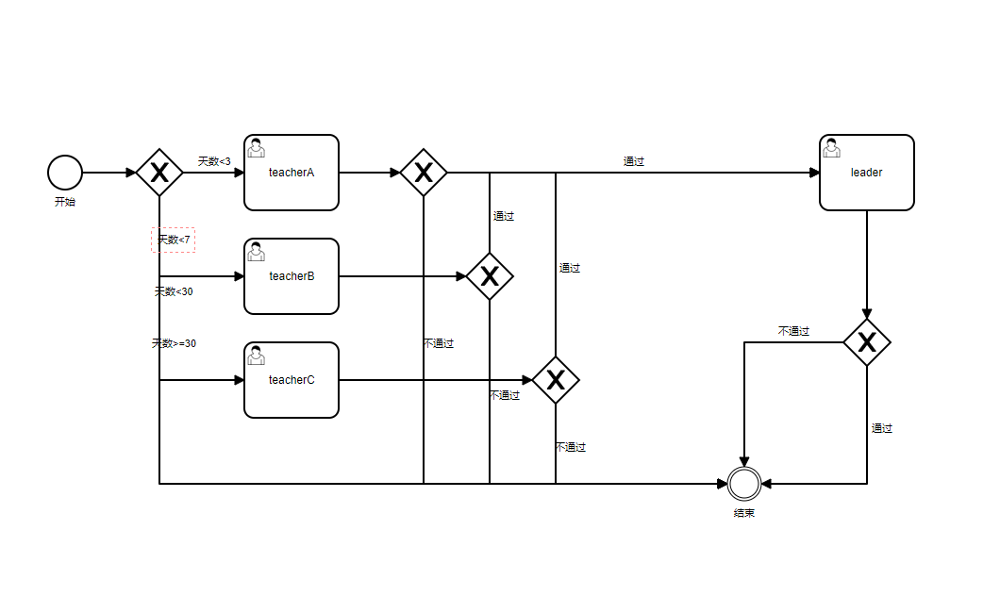

## 什么是BPMN（Business Process Model and Notation）

### 概述

业务流程模型和标记法（BPMN, Business Process Model and Notation）是对象管理组织（OMG, Object Management Group）维护的关于业务流程建模的行业性标准。它创建在与UML的活动图非常相似的流程图法（flowcharting）基础上，为“业务流程图”（BPD, Business Process Diagram）[3]中的特定业务流程提供一套图形化标记法。BPMN的目标是，通过提供一套既符合业务人员直观又能表现复杂流程语义的标记法，同时为技术人员和业务人员从事业务流程管理提供支持。BPMN规范还提供从标记法的图到执行语言基础构造的映射，尤其是业务流程执行语言（BPEL）。

BPMN的首要目的是提供全体业务相关者易于理解的标准标记法。业务相关者包括创造与梳理流程的业务分析师、负责实施流程的技术开发者、以及管理和监督流程的经理人。BPMN旨在充当公共语言，跨越业务流程设计和实施之间常见的鸿沟。

当前有多种竞争的业务流程建模语言标准供建模过程和工具选用。广泛采用BPMN将有助于统一基本的业务流程概念的表达（例如：公共或私有的流程、编排），就像一些高级的业务概念一样（例如：例外处理、事务补偿）。

### 历史

BPMN最初由业务流程管理倡议组织（BPMI, Business Process Management Initiative）开发，该组织于2005年与对象管理组织（OMG, Object Management Group）合并，从那时起，由OMG维护。BPMN最初的名称为"Business Process Modeling Notation"，即“业务流程建模标记法”，2011年1月OMG发布2.0版本，同时改为现在的名称。

### 基本组成

- 流对象（Flow Object）
    - 事件（Events）
        - 开始事件（Start event）
        - 结束事件（End event）
        - 中间事件（Intermediate event）
    - 活动（Activities）
        - 任务（Task）
        - 子流程（Sub-process）
        - 事务（Transaction）
    - 网关（Gateways）
        - 排他网关（Exclusive Gateway）
        - Exclusive Gateway Example
        - Parallel Gateway
        - Inclusive Gateway
        - Exclusive Event-based Gateway
        - Complex Decision Gateway
        - Parallel Event-Based Gateway
- 连接对象（Connecting Objects）
    - 顺序流（Sequence Flow）
    - 消息流（Message Flow）
    - 关联（Association）
- 泳道（Swimlanes）
    - 池（Pool）
    - 道（Lane）
- 器物（Artifacts/Artefacts）
    - 数据对象（Data Object）
    - 组（Group）
    - 注释（Annotation）

### 使用



---

## 什么是Activiti

Activiti是用Java编写的开源 工作流引擎，可以执行BPMN 2.0中描述的业务流程。 Activiti是Alfresco Alfresco过程服务（APS）的基础，而Alfresco是Activiti项目的主要赞助商。

### 开源协议

Apache License 2.0

### 历史

2010年3月，jBPM的两个主要开发人员Tom Baeyens和Joram Barrez离开了Red Hat，并以Alfresco的雇员的身份创立了Activiti 。Activiti基于他们在jBPM上的工作流程经验，但它是一个新的代码库，而不是基于任何以前的jBPM代码。

Activiti的第一个版本是5.0，表明产品是他们通过jBPM 1到4获得的经验的延续。

2016年10月，Barrez，Rademakers（Activiti in Action 的作者）和其他贡献者离开了Alfresco。即将离任的开发人员分叉了Activiti代码以启动一个名为Flowable的新项目。

2017年2月，发布了新的Activiti商业版，并将其更名为Alfresco Process Services。

2017年5月，Activiti发布了版本6.0.0 ，其中对ad-hoc子流程提供了新的支持，并提供了新的应用程序用户界面。

>[Another rift in the open source BPM market](https://web.archive.org/web/20161230085710/https://www.enterpriseirregulars.com/110881/another-rift-open-source-bpm-market-flowablebpm-forks-alfresco-activiti/)

>[Activiti founders fork the project to create Flowable, an open source BPM engine](https://web.archive.org/web/20161230090047/http://ecmarchitect.com/archives/2016/10/15/4192)

## Activiti应用场景

## Activiti使用

### 数据库表设计


|表名|用途|备注|
|:---|:---|:---|
|ACT_EVT_LOG|事件处理日志|-|
|ACT_GE_BYTEARRAY|二进制数据表|存储流程定义相关的部署信息。即流程定义文档的存放地。每部署一次就会增加两条记录，一条是关于BPMN规则文件的，一条是图片的（如果部署时只指定了BPMN一个文件，Activiti会在部署时解析BPMN文件内容自动生成流程图）。两个文件不是很大，都是以二进制形式存储在数据库中。|
|ACT_GE_PROPERTY|主键生成表|主张表将生成下次流程部署的主键ID。|
|ACT_HI_ACTINST|历史节点表|只记录usertask内容,某一次流程的执行一共经历了多少个活动|
|ACT_HI_ATTACHMENT|历史附件表|-|
|ACT_HI_COMMENT|历史意见表|-|
|ACT_HI_DETAIL|历史详情表，提供历史变量的查询|流程中产生的变量详细，包括控制流程流转的变量等|
|ACT_HI_IDENTITYLINK|历史流程人员表|-|
|ACT_HI_PROCINST|历史流程实例表|-|
|ACT_HI_TASKINST|历史任务实例表|一次流程的执行一共经历了多少个任务|
|ACT_HI_VARINST|历史变量表|-|
|ACT_PROCDEF_INFO||-|
|ACT_RE_DEPLOYMENT|部署信息表|存放流程定义的显示名和部署时间，每部署一次增加一条记录|
|ACT_RE_MODEL|流程设计模型部署表|流程设计器设计流程后，保存数据到该表|
|ACT_RE_PROCDEF|流程定义数据表|存放流程定义的属性信息，部署每个新的流程定义都会在这张表中增加一条记录。注意：当流程定义的key相同的情况下，使用的是版本升级|
|ACT_RU_DEADLETTER_JOB|-|-|
|ACT_RU_EVENT_SUBSCR|throwEvent，catchEvent时间监听信息表|-|
|ACT_RU_EXECUTION|运行时流程执行实例表|历史流程变量|
|ACT_RU_IDENTITYLINK|运行时流程人员表|主要存储任务节点与参与者的相关信息|
|ACT_RU_INTEGRATION|-|-|
|ACT_RU_JOB|运行时定时任务数据表|-|
|ACT_RU_SUSPENDED_JOB|-|-|
|ACT_RU_TASK|运行时任务节点表|-|
|ACT_RU_TIMER_JOB|-|-|
|ACT_RU_VARIABLE|运行时流程变量数据表|通过JavaBean设置的流程变量，在act_ru_variable中存储的类型为serializable，变量真正存储的地方在act_ge_bytearray中。|

## 总结

## 遇到的问题

### Spring boot 初始化表格报错

  如果同一个数据库地址下面有多个库，当其中某个库已经生成过表时。别的库生成数据库的时候会报错。在数据库URL后面加上参数`nullCatalogMeansCurrent=true`  
例如：`jdbc:mysql://127.0.0.1:3306/activiti?nullCatalogMeansCurrent=true`  
> [深入分析mysql 6.0.6 和 activiti 6.0.0自动创建表失败的问题](https://blog.csdn.net/jiaoshaoping/article/details/80748065)

### VSCODE编辑BPMN文件导入Activiti报错

```xml
<bpmn2:ioSpecification>
    <bpmn2:dataInput id="_30740806-95FC-43E9-B9AC-7973292B2F70_TaskNameInputX" drools:dtype="Object" itemSubjectRef="__30740806-95FC-43E9-B9AC-7973292B2F70_TaskNameInputXItem" name="TaskName"/>
    <bpmn2:dataInput id="_30740806-95FC-43E9-B9AC-7973292B2F70_SkippableInputX" drools:dtype="Object" itemSubjectRef="__30740806-95FC-43E9-B9AC-7973292B2F70_SkippableInputXItem" name="Skippable"/>
    <bpmn2:inputSet>
        <bpmn2:dataInputRefs>_30740806-95FC-43E9-B9AC-7973292B2F70_TaskNameInputX</bpmn2:dataInputRefs>
        <bpmn2:dataInputRefs>_30740806-95FC-43E9-B9AC-7973292B2F70_SkippableInputX</bpmn2:dataInputRefs>
    </bpmn2:inputSet>
    <bpmn2:outputSet/>
</bpmn2:ioSpecification>

```

## 扩展阅读

### 什么是Flowable

Activit的一个分支

[Flowable roadmap](https://github.com/flowable/flowable-engine/wiki/Flowable-roadmap)  

[Activiti roadmap](https://github.com/Activiti/Activiti/wiki/Activiti-Roadmap)

### 什么是Activiti Cloud

>Activiti Cloud is a set of Cloud Native components designed from the ground up to work in distributed environments. We have chosen Kubernetes as our main deployment infrastructure and we are using Spring Cloud / Spring Boot along with Docker for containerization of these components.

>Activiti Cloud是一组Cloud Native组件，它们是从头开始设计的，可以在分布式环境中工作。我们选择Kubernetes作为我们的主要部署基础架构，并且我们将Spring Cloud / Spring Boot和Docker一起用于这些组件的容器化。

#### 组成（5个模块）

- Activiti Cloud Runtime Bundle
- Activiti Cloud Query
- Activiti Cloud Audit
- Activiti Cloud Connectors
- Activiti Cloud Notifications Service (GraphQL)

### Jeesite

一个集成了工作流的国产开源项目（[AGPL-3.0](https://opensource.org/licenses/AGPL-3.0)）

---

## 参考

- [What is BPMN?](https://www.visual-paradigm.com/guide/bpmn/what-is-bpmn/)
- [BPMN Wiki](https://zh.wikipedia.org/wiki/%E4%B8%9A%E5%8A%A1%E6%B5%81%E7%A8%8B%E6%A8%A1%E5%9E%8B%E5%92%8C%E6%A0%87%E8%AE%B0%E6%B3%95)
- [OMG BPMN（Object Management Group Business Process Model and Notation）](https://www.bpmn.org/)
- [BPMN gateway types](https://www.visual-paradigm.com/guide/bpmn/bpmn-gateway-types/)
- [BPMN前端库](https://bpmn.io/toolkit/bpmn-js/)
- [Activiti Github organization](https://github.com/Activiti)
- [Activiti Github 核心仓库](https://github.com/Activiti/Activiti)
- [Activiti7 Document](https://activiti.gitbook.io/activiti-7-developers-guide/)
- [Activiti6 Document](https://www.activiti.org/userguide/)
- [Activiti6 Java Docs](https://www.activiti.org/javadocs/)
- [Spring Activiti](https://www.baeldung.com/spring-activiti)
- [Spring Activiti Github](https://github.com/eugenp/tutorials/tree/master/spring-activiti)
- [Activiti7.X结合SpringBoot2.1、Mybatis](https://dinghuang.github.io/2020/03/14/Activiti7.X%E7%BB%93%E5%90%88SpringBoot2.1%E3%80%81Mybatis/)
- [Ruoyi Vue Activiti](https://gitee.com/smell2/ruoyi-vue-activiti)
- [Jeesite官网](https://jeesite.com/)
- [开发一个简单的SpringBoot activiti应用](https://zhuanlan.zhihu.com/p/340142234)
- [Activiti就是这么简单](https://juejin.cn/post/6844903577757057038)